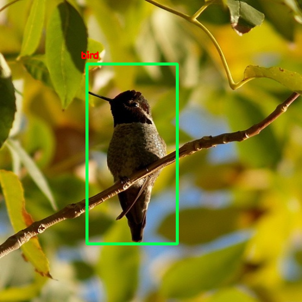
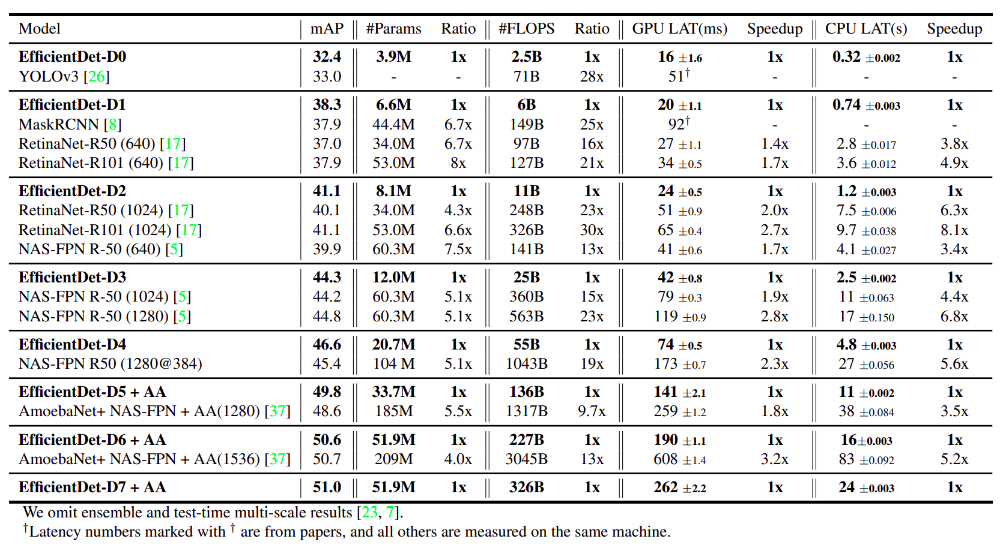

# EfficientDet: Scalable and Efficient Object Detection, in PyTorch
A [PyTorch](http://pytorch.org/) implementation of [EfficientDet](https://arxiv.org/pdf/1911.09070.pdf) from the 2019 paper by Mingxing Tan Ruoming Pang Quoc V. Le
Google Research, Brain Team.  The official and original: comming soon.


### Table of Contents
- <a href='#installation'>Installation</a>
- <a href='#datasets'>Datasets</a>
- <a href='#training-efficientdet'>Train</a>
- <a href='#evaluation'>Evaluate</a>
- <a href='#performance'>Performance</a>
- <a href='#demo'>Demo</a>
- <a href='#todo'>Future Work</a>
- <a href='#references'>Reference</a>

&nbsp;
&nbsp;
&nbsp;
&nbsp;

## Installation
- Install [PyTorch](http://pytorch.org/) by selecting your environment on the website and running the appropriate command.
- Clone this repository.
  * Note: We currently only support Python 3.6+.
- Then download the dataset by following the [instructions](#datasets) below.
- Note: For training, we currently support [VOC](http://host.robots.ox.ac.uk/pascal/VOC/) and [COCO](http://mscoco.org/), and aim to add [ImageNet](http://www.image-net.org/) support soon.

## Datasets
To make things easy, we provide bash scripts to handle the dataset downloads and setup for you.  We also provide simple dataset loaders that inherit `torch.utils.data.Dataset`, making them fully compatible with the `torchvision.datasets` [API](http://pytorch.org/docs/torchvision/datasets.html).


### COCO
Microsoft COCO: Common Objects in Context

##### Download COCO 2014
```Shell
# specify a directory for dataset to be downloaded into, else default is ~/data/
sh data/scripts/COCO2014.sh
```

### VOC Dataset
PASCAL VOC: Visual Object Classes

##### Download VOC2007 trainval & test
```Shell
# specify a directory for dataset to be downloaded into, else default is ~/data/
sh data/scripts/VOC2007.sh # <directory>
```

##### Download VOC2012 trainval
```Shell
# specify a directory for dataset to be downloaded into, else default is ~/data/
sh data/scripts/VOC2012.sh # <directory>
```

## Training EfficientDet

- To train EfficientDet using the train script simply specify the parameters listed in `train.py` as a flag or manually change them.

```Shell
python train.py
``

## Evaluation
To evaluate a trained network:
## Demo
```
python demo.py 
```

Output: 





## Results on the validation set VOC 2012


| Models | mAP| params | FLOPs |
| ------ | ------ | ------ | ------ |
| **EfficientDet-D0** | **training** | **training** | **training** |
| **EfficientDet-D1** | comming soon | comming soon | comming soon |
| **EfficientDet-D2** | comming soon | comming soon | comming soon |
| **EfficientDet-D3** | comming soon | comming soon | comming soon |
| **EfficientDet-D4** | comming soon | comming soon | comming soon |
| **EfficientDet-D5+AA** | comming soon | comming soon | comming soon |
| **EfficientDet-D6+AA** | comming soon | comming soon | comming soon |
| **EfficientDet-D7+AA** | comming soon | comming soon | comming soon |


## Performance




## TODO
We have accumulated the following to-do list, which we hope to complete in the near future
- Still to come:
  * [x] EfficientDet
  * [x] GPU-Parallel
  * [x] NMS
  * [ ] Soft-NMS
  * [ ] Weighted Feature Fusion
  * [ ] Pretrained model
  * [ ] Demo
  * [ ] Model zoo 
  

## Authors

* [**Toan Dao Minh**](https://github.com/toandaominh1997)

***Note:*** Unfortunately, this is just a hobby of ours and not a full-time job, so we'll do our best to keep things up to date, but no guarantees.  That being said, thanks to everyone for your continued help and feedback as it is really appreciated. We will try to address everything as soon as possible.

## References
- tanmingxing, rpang, qvl, et al. "EfficientDet: Scalable and Efficient Object Detection." [EfficientDet]((https://arxiv.org/abs/1911.09070)).
- A list of other great EfficientDet ports that were sources of inspiration:
  * [EfficientNet](https://github.com/lukemelas/EfficientNet-PyTorch)
  * [SSD.Pytorch](https://github.com/amdegroot/ssd.pytorch)
  * [RetinaNet.Pytorch](https://github.com/yhenon/pytorch-retinanet)
  * [NMS.Torchvision](https://pytorch.org/docs/stable/torchvision/ops.html)
  
