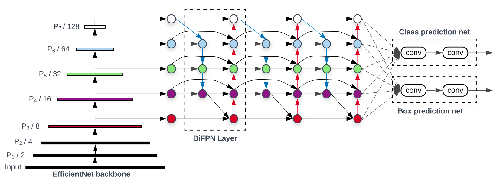
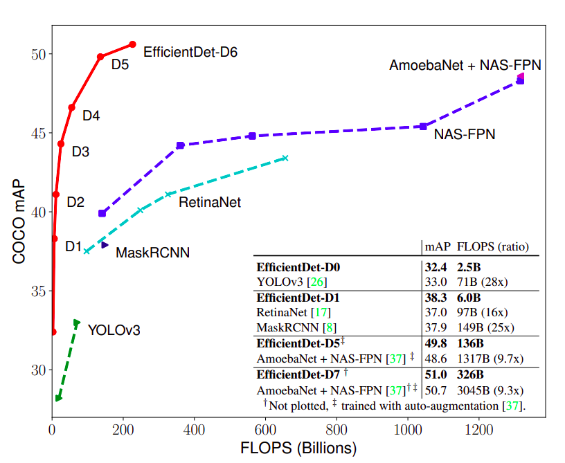

# EfficientDet: Scalable and Efficient Object Detection, in PyTorch
A [PyTorch](http://pytorch.org/) implementation of [EfficientDet](https://arxiv.org/abs/1911.09070) from the 2019 paper by Mingxing Tan Ruoming Pang Quoc V. Le
Google Research, Brain Team.  The official and original: comming soon.




# Fun with Demo:
```Shell
python demo.py --weight ./checkpoint_VOC_efficientdet-d1_97.pth --threshold 0.6 --iou_threshold 0.5 --cam --score
```

<p align="center">

</p>


### Table of Contents
- <a href='#recent-update'>Recent Update</a>
- <a href='#benchmarking'>Benchmarking</a>
- <a href='#installation'>Installation</a>
- <a href='#installation'>Installation</a>
- <a href='#prerequisites'>Prerequisites</a>
- <a href='#datasets'>Datasets</a>
- <a href='#training-efficientdet'>Train</a>
- <a href='#evaluation'>Evaluate</a>
- <a href='#performance'>Performance</a>
- <a href='#demo'>Demo</a>
- <a href='#todo'>Future Work</a>
- <a href='#references'>Reference</a>

&nbsp;
&nbsp;
&nbsp;
&nbsp;

## Recent Update
 - [06/01/2020] Support both DistributedDataParallel and DataParallel, change augmentation, eval_voc
 - [17/12/2019] Add Fast normalized fusion, Augmentation with Ratio, Change RetinaHead, Fix Support EfficientDet-D0->D7
 - [7/12/2019] Support EfficientDet-D0, EfficientDet-D1, EfficientDet-D2, EfficientDet-D3, EfficientDet-D4,... . Support change gradient accumulation steps, AdamW.
## Benchmarking

We benchmark our code thoroughly on three datasets: pascal voc and coco, using family efficientnet different network architectures: EfficientDet-D0->7. Below are the results:

1). PASCAL VOC 2007 (Train/Test: 07trainval/07test, scale=600, ROI Align)

model    | mAP |
---------|--------|
[EfficientDet-D0(with Weight)](https://drive.google.com/file/d/1r7MAyBfG5OK_9F_cU8yActUWxTHOuOpL/view?usp=sharing | 62.16


## Installation
- Install [PyTorch](http://pytorch.org/) by selecting your environment on the website and running the appropriate command.
- Clone this repository and install package [prerequisites](#prerequisites) below.
- Then download the dataset by following the [instructions](#datasets) below.
- Note: For training, we currently support [VOC](http://host.robots.ox.ac.uk/pascal/VOC/) and [COCO](http://mscoco.org/), and aim to add [ImageNet](http://www.image-net.org/) support soon.

### prerequisites

* Python 3.6+
* PyTorch 1.3+
* Torchvision 0.4.0+ (**We need high version because Torchvision support nms now.**)
* requirements.txt 
## Datasets
To make things easy, we provide bash scripts to handle the dataset downloads and setup for you.  We also provide simple dataset loaders that inherit `torch.utils.data.Dataset`, making them fully compatible with the `torchvision.datasets` [API](http://pytorch.org/docs/torchvision/datasets.html).

### VOC Dataset
PASCAL VOC: Visual Object Classes

##### Download VOC2007 + VOC2012 trainval & test
```Shell
# specify a directory for dataset to be downloaded into, else default is ~/data/
sh datasets/scripts/VOC2007.sh
sh datasets/scripts/VOC2012.sh
```

### COCO
Microsoft COCO: Common Objects in Context

##### Download COCO 2017
```Shell
# specify a directory for dataset to be downloaded into, else default is ~/data/
sh datasets/scripts/COCO2017.sh
```

## Training EfficientDet

- To train EfficientDet using the train script simply specify the parameters listed in `train.py` as a flag or manually change them.

```Shell
python train.py --network effcientdet-d0  # Example
```

  - With VOC Dataset:
  ```Shell
  # DataParallel
  python train.py --dataset VOC --dataset_root /root/data/VOCdevkit/ --network effcientdet-d0 --batch_size 32 
  # DistributedDataParallel with backend nccl
  python train.py --dataset VOC --dataset_root /root/data/VOCdevkit/ --network effcientdet-d0 --batch_size 32 --multiprocessing-distributed
  ```
  - With COCO Dataset:
  ```Shell
  # DataParallel
  python train.py --dataset COCO --dataset_root ~/data/coco/ --network effcientdet-d0 --batch_size 32
  # DistributedDataParallel with backend nccl
  python train.py --dataset COCO --dataset_root ~/data/coco/ --network effcientdet-d0 --batch_size 32 --multiprocessing-distributed
  ```

## Evaluation
To evaluate a trained network:
 - With VOC Dataset:
    ```Shell
    python eval_voc.py --dataset_root ~/data/VOCdevkit --weight ./checkpoint_VOC_efficientdet-d0_261.pth
    ```
- With COCO Dataset
comming soon.
## Demo

```Shell
python demo.py --threshold 0.5 --iou_threshold 0.5 --score --weight checkpoint_VOC_efficientdet-d1_34.pth --file_name demo.png
```

Output: 

<p align="center">

</p>

## Webcam Demo

You can use a webcam in a real-time demo by running:
```Shell
python demo.py --threshold 0.5 --iou_threshold 0.5 --cam --score --weight checkpoint_VOC_efficientdet-d1_34.pth
```

## Performance



## TODO
We have accumulated the following to-do list, which we hope to complete in the near future
- Still to come:
  * [x] EfficientDet-[D0-7]
  * [x] GPU-Parallel
  * [x] NMS
  * [ ] Soft-NMS
  * [x] Pretrained model
  * [x] Demo
  * [ ] Model zoo
  * [ ] TorchScript
  * [ ] Mobile
  * [ ] C++ Onnx
  

## Authors

* [**Toan Dao Minh**](https://github.com/toandaominh1997)

***Note:*** Unfortunately, this is just a hobby of ours and not a full-time job, so we'll do our best to keep things up to date, but no guarantees.  That being said, thanks to everyone for your continued help and feedback as it is really appreciated. We will try to address everything as soon as possible.

## References
- tanmingxing, rpang, qvl, et al. "EfficientDet: Scalable and Efficient Object Detection." [EfficientDet](https://arxiv.org/abs/1911.09070).
- A list of other great EfficientDet ports that were sources of inspiration:
  * [EfficientNet](https://github.com/lukemelas/EfficientNet-PyTorch)
  * [SSD.Pytorch](https://github.com/amdegroot/ssd.pytorch)
  * [mmdetection](https://github.com/open-mmlab/mmdetection)
  * [RetinaNet.Pytorch](https://github.com/yhenon/pytorch-retinanet)
  * [NMS.Torchvision](https://pytorch.org/docs/stable/torchvision/ops.html)
  

## Citation

    @article{efficientdetpytoan,
        Author = {Toan Dao Minh},
        Title = {A Pytorch Implementation of EfficientDet Object Detection},
        Journal = {github.com/toandaominh1997/EfficientDet.Pytorch},
        Year = {2019}
    }
